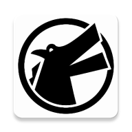

Contactzilla Sync Client App
=====================

Please see the [Contactzilla website](https://contactzilla.com) for
detailed information about the software.

The software is a CardDAV client forked from PeopleSync which is forked from DAVx⁵. This product has been amended to work better for our product when provisioned with MDM solutions. For the personal usage of CardDAV and CalDAV we recommend to use the [DAVx⁵](https://www.davx5.com) app with more configuration options.

The Contactzilla Sync client app is licensed under the [GPLv3 License](LICENSE).

The Contactzilla server software is a [cloud based CardDAV solution for businesses](https://contactzilla.com) and is proprietary commercial software.

The Contactzilla Sync client app is based on [PeopleSync](https://www.messageconcept.com/en/products/peoplesync/) which is based on [DAVx⁵](https://www.davx5.com) and parts of DAVx⁵ have been outsourced into these libraries:

* [cert4android](https://github.com/bitfireAT/cert4android) – custom certificate management
* [dav4jvm](https://github.com/bitfireAT/dav4jvm) – WebDAV/CalDav/CardDAV framework
* [vcard4android](https://github.com/bitfireAT/vcard4android) – vCard processing and Contacts Provider access

USED THIRD-PARTY LIBRARIES
==========================

* [dnsjava](https://github.com/dnsjava/dnsjava) – [BSD License](https://github.com/dnsjava/dnsjava/blob/master/LICENSE)
* [ez-vcard](https://github.com/mangstadt/ez-vcard) – [New BSD License](https://github.com/mangstadt/ez-vcard/blob/master/LICENSE)
* [okhttp](https://square.github.io/okhttp) – [Apache License, Version 2.0](https://square.github.io/okhttp/#license)

See _About / Libraries_ in the app for all used libraries and their licenses.
